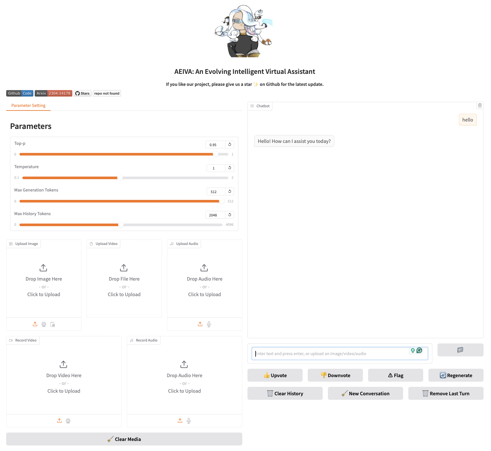

<p align="center" width="100%">

</p>

# AEIVA: An Evolving Intelligent Virtual Assistant

<p align="center">
<a href="docs/README_CN.md"></a>
<a href="README.md"></a>
<!-- <a href="docs/README_JA.md"></a> -->
<!-- <a href="https://discord.gg/wCp6Q3fsAk"></a> -->
<a href="https://opensource.org/license/apache-2-0/"></a>
<!-- <a href="docs/ROADMAP.md"></a> -->
<!-- <a href="docs/resources/MetaGPT-WeChat-Personal.jpeg"></a> -->
<!-- <a href="https://twitter.com/DeepWisdom2019"></a> -->
</p>


## Introduction

In this project, our objective is to develop a modular and flexible intelligent agent and society system, designed as a virtual assistant capable of performing diverse tasks, learning from data, environment, and interactions, and self-evolving over time. The system will leverage deep learning models, primarily transformers, while also exploring innovative models and learning methods. 

Our ultimate goal is to develop a General AI Agent System capable of forming a “genius society” of AI agents. These agents will:

- Collaboratively address and solve societal challenges across domains.
- Function in diverse environments, from virtual simulations to real-world applications.
- Continuously evolve and improve through self-assessment and adaptation.
- Serve as versatile assistants in various roles, such as AI researchers, software engineers, game players, or digital society members.

Currently, Aeiva supports the following interaction modes:

- Chat in terminal: chat with an agent in the terminal interface
- Chat with Gradio Webui: we developed a gradio web UI interface that allows user to chat with the agent. We plan to support multimodality in the near future.
- Chat with desktop Waifu mode: by combining with our another project `Maid`, we can use our agent as the backend and call it through Maid desktop assistant. 

## Key Features

Currently, we features with the following functionalities:

- **Rich Toolkits**: I have implemented a series of different API tools and I'm keep improving the API library.
- **Open Operator**: By implementing computer-use related tools, aeiva is able to understand and operate user's computer and complete daily tasks. We are keep enhancing the functionality in this part. Note: use this feature with caution!
- **Memory Palace**: I have designed and implemented a layered memory palace for storaging agent memories. It is flexible and can be customized to represent and query different types of memories.

More functionalities and modules will be implemented gradually. Keep tuned! If you find any errors or bugs, feel free to report by opening an issue, thanks a lot!

## Installation
To install AEIVA, follow these steps:
### Prerequisites
* `Python 3.9` or newer
* `pip` (Python package manager)

### Option 1: Install via `pip` [recommended]
You can easily install vai pip by:

```shell
pip install aeiva
```

### Option 2: Install from Repository
1. **Clone the AEIVA Repository**

	First, clone the AEIVA repository to your local machine using Git:

	```bash
	git clone https://github.com/chatsci/Aeiva.git
	cd Aeiva
	```

2. **Create a Virtual Environment (Recommended)**
It's a good practice to create a virtual environment for Python projects. This keeps dependencies required by different projects separate. Use the following command to create a virtual environment with `conda`:

	```bash
	conda create --name <my-env>
	```
	
	Replace `<my-env>` with the name of your environment.
	
	To acivate your env:
	
	```bash
	conda activate <my-env>
	```
	
	For more advanced configurations or options, please check the online document of `conda`.
	
3. **Install Dependencies**
	Install all dependencies listed in **requirements.txt**:
	
	```bash
	pip install -r requirements.txt
	```

4. **Install Aeiva**
	Finally, install AEIVA using the **setup.py** script:
	
	```bash
	python setup.py install
	```
	
5. **Verify Installation**
	To verify that AEIVA has been installed correctly, you can run the following command:
	
	```bash
	python -c "import aeiva; print(aeiva.__version__)"
	```


## Dependencies

Our memory module utilizes different types of databases.

1. **Vector Database**: Our memory module also utilizes vector database. Please install vector database such as `milvus` (recommended), `chroma`, `qdrant`, or `weaviate`.

2. **Graph Database**: Ensure Neo4j is installed and the `NEO4J_HOME` environment variable is set.

3. **Relational Database**: We use `sqlite` (recommended) or `postgre sql`.

## Commands

After installing Neo4j and setting the environment variable, follow these steps to run different aeiva chat commands.


### Aeiva Chat in Terminal Mode
Run the following command in terminal:

   ```bash
   aeiva-chat-terminal --config configs/agent_config.yaml --verbose
   ```
   
   	* Options:
		- `--config` or `-c`: Path to the configuration file (default: `configs/agent_config.yaml`).
		- `--verbose` or `-v`: Enable verbose logging for detailed output.

	* Using the Interface:
		-	Interact with the chatbot directly in your terminal after running the command.	*	View Logs:
		-	Logs are stored at `~/.aeiva/logs/aeiva-chat-terminal.log`.
		-	To monitor logs in real-time, use:
		```shell
		tail -f ~/.aeiva/logs/aeiva-chat-terminal.log
	```

You will see your terminal is like below:


### Aeiva Chat in Gradio Mode
Run the following command in terminal:

   ```bash
   aeiva-chat-gradio --config configs/agent_config.yaml --verbose
   ```
   
   	* Options:
		- `--config` or `-c`: Path to the configuration file (default: `configs/agent_config.yaml`).
		- `--verbose` or `-v`: Enable verbose logging for detailed output.

	* Access the Gradio Interface:
		-	Open your web browser and navigate to http://localhost:7860.
		-	Alternatively, use the public URL provided in the terminal output (e.g., https://1b1f89328e57b2f2e1.gradio.live) to access the interface remotely.
	*	View Logs:
		-	Logs are stored at `~/.aeiva/logs/aeiva-chat-gradio.log`.
		-	To monitor logs in real-time, use:
		```shell
		tail -f ~/.aeiva/logs/aeiva-chat-gradio.log
		```

By visiting the gradio interface, you will see a gradio web-ui like below:

---


---


## Contact


