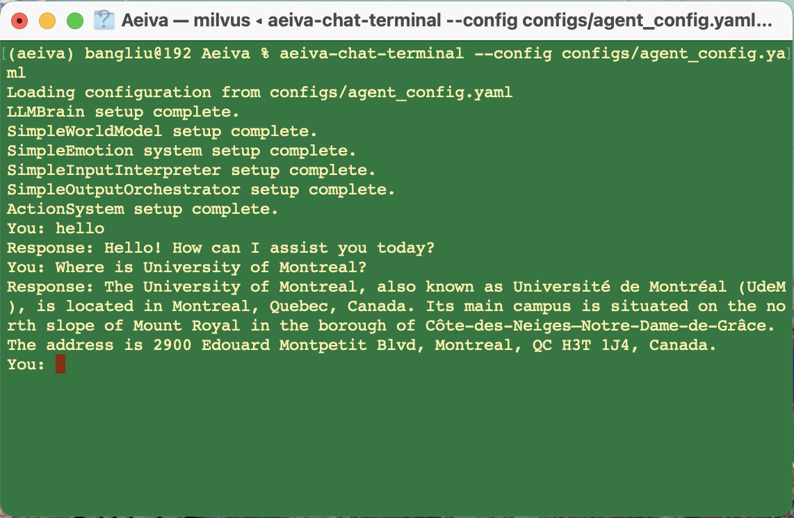
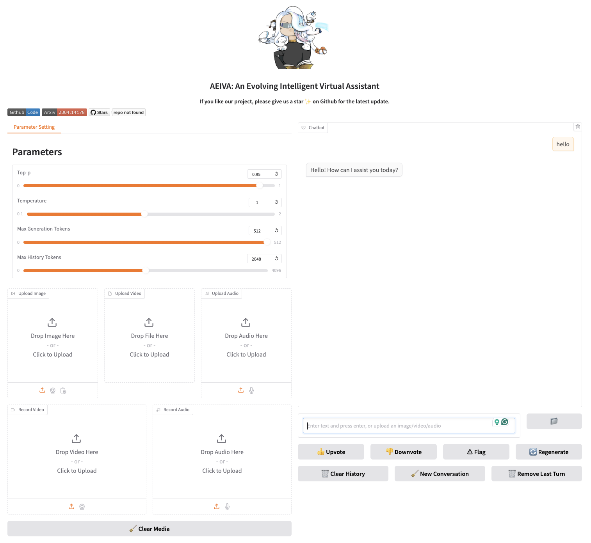

<p align="center" width="100%">

</p>

# AEIVA: 一个不断进化的智能虚拟助手

<p align="center">
<a href="README_CN.md"></a>
<a href="README.md"></a>
<a href="https://opensource.org/license/apache-2-0/"></a>
</p>

## 简介

在这个项目中，我们的目标是开发一个模块化和灵活的智能代理与社会系统，旨在作为能够执行多种任务、从数据、环境和交互中学习，并随时间自我进化的虚拟助手。该系统将主要利用深度学习模型（尤其是transformers），同时探索创新的模型和学习方法。

我们的最终目标是开发一个通用的人工智能代理系统，能够形成一个由AI代理组成的“天才社会”。这些代理可以：

- 协作解决跨领域的社会挑战；
- 在各种环境中运行，从虚拟仿真到现实应用；
- 通过自我评估和适应性不断发展和改进；
- 作为各种角色的多功能助手，如AI研究员、软件工程师、游戏玩家或数字社会成员。

目前，Aeiva支持以下交互模式：

- 终端聊天：在终端界面与代理聊天；
- Gradio WebUI 聊天：我们开发了一个 Gradio Web UI 界面，允许用户与代理聊天。我们计划在不久的将来支持多模态；
- 桌面 Waifu 模式聊天：结合我们另一个项目 `Maid`，可以将代理作为后端，通过 Maid 桌面助手调用。

## 主要功能

当前我们具有以下功能：

- **丰富的工具库**：我已经实现了一系列不同的API工具，并且正在不断完善API库；
- **开放操作员**：通过实现与计算机操作相关的工具，Aeiva能够理解并操作用户的计算机，完成日常任务。我们正在不断增强这一部分的功能。注意：请谨慎使用此功能！
- **记忆宫殿**：我设计并实现了分层记忆宫殿用于存储代理的记忆。它灵活且可定制，用于表示和查询不同类型的记忆。

更多功能和模块将逐步实现，敬请关注！如果您发现任何错误或漏洞，请随时通过创建 issue 报告，非常感谢！

## 安装
安装AEIVA的步骤如下：

### 前置要求
* `Python 3.10` 或更新版本
* `pip` (Python 包管理器)

### 方法 1：通过 `pip` 安装 [推荐]
您可以通过以下命令快速安装：

```shell
pip install aeiva
```

### 方法 2：从仓库安装
1. **克隆 AEIVA 仓库**

使用 Git 克隆 AEIVA 仓库到本地：

```bash
git clone https://github.com/chatsci/Aeiva.git
cd Aeiva
```

2. **创建虚拟环境（推荐）**
为Python项目创建虚拟环境是个好习惯，可以将不同项目的依赖分离。使用以下命令创建虚拟环境：

```bash
conda create --name <my-env>
```

用您的环境名替换 `<my-env>`。

激活您的环境：

```bash
conda activate <my-env>
```

有关更多高级配置或选项，请查看 `conda` 的在线文档。

3. **安装依赖项**
通过以下命令安装 **requirements.txt** 中列出的所有依赖项：

```bash
pip install -r requirements.txt
```

4. **安装 Aeiva**
最后，使用 **setup.py** 脚本安装 AEIVA：

```bash
python setup.py install
```

5. **验证安装**
运行以下命令以验证 AEIVA 是否已正确安装：

```bash
python -c "import aeiva; print(aeiva.__version__)"
```

## 依赖项

我们的记忆模块使用了不同类型的数据库。

1. **向量数据库**：我们的记忆模块也使用向量数据库。请安装诸如 `milvus`（推荐）、`chroma`、`qdrant` 或 `weaviate` 等向量数据库。

2. **图数据库**：确保安装 Neo4j 并设置 `NEO4J_HOME` 环境变量。

3. **关系型数据库**：我们推荐使用 `sqlite` 或 `postgre sql`。

## 命令

在安装 Neo4j 并设置环境变量后，您可以使用以下步骤运行不同的 Aeiva 聊天命令：

### 🪄⭐终端模式聊天
在终端中运行以下命令：

```bash
aeiva-chat-terminal --config configs/agent_config.yaml --verbose
```

* **选项**：
  - `--config` 或 `-c`：配置文件的路径（默认：`configs/agent_config.yaml`）；
  - `--verbose` 或 `-v`：启用详细日志记录以获取详细输出。

运行命令后，您可以直接在终端与聊天机器人交互。

查看日志：

日志存储在 `~/.aeiva/logs/aeiva-chat-terminal.log` 中。

实时监控日志：

```shell
tail -f ~/.aeiva/logs/aeiva-chat-terminal.log
```

终端界面如下所示：

<p align="center" width="100%">
    
</p>

### 🪄⭐Gradio 模式聊天
在终端中运行以下命令：

```shell
aeiva-chat-gradio --config configs/agent_config.yaml --verbose
```

* **选项**：
  - `--config` 或 `-c`：配置文件的路径（默认：`configs/agent_config.yaml`）；
  - `--verbose` 或 `-v`：启用详细日志记录以获取详细输出。

* **访问 Gradio 界面**：
  - 打开您的浏览器并导航至 `http://localhost:7860`；
  - 或者，使用终端输出提供的公共URL（如 `https://1b1f89328e57b2f2e1.gradio.live`）远程访问界面。

查看日志：

日志存储在 `~/.aeiva/logs/aeiva-chat-gradio.log` 中。

实时监控日志：

```shell
tail -f ~/.aeiva/logs/aeiva-chat-gradio.log
```

Gradio 界面如下所示：

<p align="center" width="100%">
    
</p>

---

### 🪄⭐Maid 聊天

在终端运行以下命令，获取一个桌面上的动画虚拟助手，可以语音模式或输入文本与您互动：

```bash
maid-chat --config configs/agent_config.yaml --host 0.0.0.0 --port 8000 --verbose
```

* **选项**：
  - `--config` 或 `-c`：配置文件的路径（默认：`configs/agent_config.yaml`）；
  - `--host` 或 `-H`：运行服务器的主机地址（默认：`0.0.0.0`）；
  - `--port` 或 `-p`：运行服务器的端口号（默认：`8000`）；
  - `--verbose` 或 `-v`：启用详细日志记录以获取详细输出。

* **下载 `Maid.app`**：
  - 从 [提供下载链接或说明] 下载 `Maid.app`；

* **设置 `MAID_HOME` 环境变量**：
  - Unix/Linux/macOS:
    ```shell
    export MAID_HOME='/path/to/my/unity.app/Contents/MacOS/Maid - Your Intelligent Waifu !'
    source ~/.bashrc  # 或 source ~/.zshrc
    ```
  - Windows (命令提示符):
    ```shell
    set MAID_HOME=C:\path\to\my\unity\app
    ```
  - Windows (PowerShell):
    ```shell
    $env:MAID_HOME = "C:\path\to\my\unity\app"
    ```
    将 `/path/to/my/unity/app` 或 `C:\path\to\my\unity\app` 替换为您的 Unity 应用程序的实际路径。

* **使用界面**：
  - 在运行命令后通过 Maid.app Unity 应用程序与服务器交互。

查看日志：

日志存储在 `~/.aeiva/logs/maid-chat.log` 中。

实时监控日志：

```shell
tail -f ~/.aeiva/logs/maid-chat.log
```

Maid聊天界面演示：

<p align="center" width="100%">
    <a href="https://www.youtube.com/watch?v=ITk1aXSfWAg">
        
    </a>
</p>

## 引用

如果需要在出版物中引用 [Aeiva](https://github.com/chatsci/Aeiva)，请使用以下 BibTeX 条目：

```bibtex
@misc{bang2024aeiva,
      title={Aeiva: 一个不断进化的智能虚拟助手}, 
      author={Bang Liu},
      year={2024},
      url={https://github.com/chatsci/Aeiva}
}
```

## 联系方式

<p align="center" width="100%">

</p>
